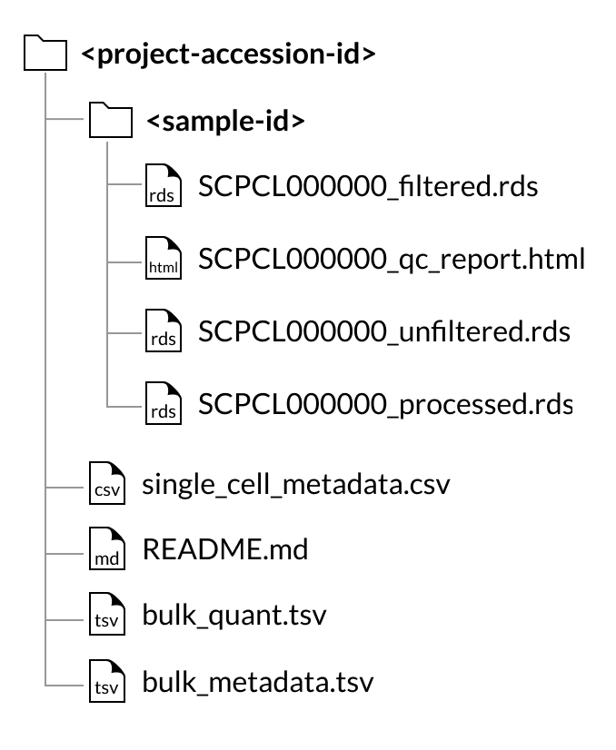
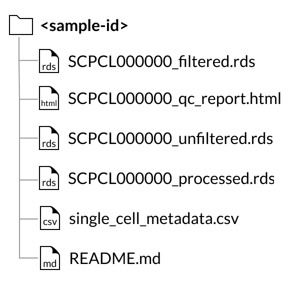
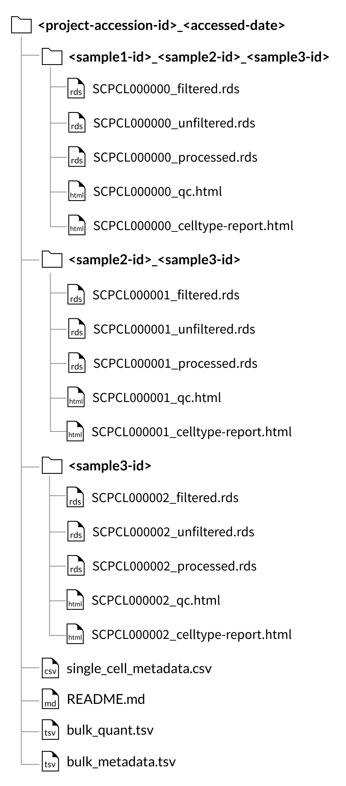
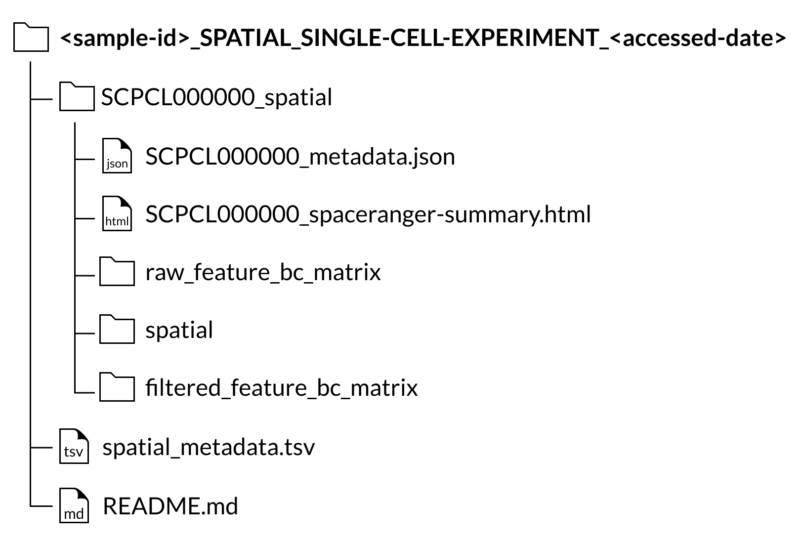

# Downloadable files

The ScPCA Portal download packages include gene expression data, a QC report, and associated metadata for each processed sample.
These files are delivered as a zip file.
When you uncompress the zip file, the root directory name of your download will include the date you accessed the data on the ScPCA Portal.

For all downloads, sample folders (indicated by the `SCPCS` prefix) contain the files for all libraries (`SCPCL` prefix) derived from that biological sample.
Most samples only have one library that has been sequenced.
For [multiplexed sample libraries](#multiplexed-sample-libraries), the sample folder name will be an underscore-separated list of all samples found in the library files that the folder contains.

See the {ref}`FAQ section about samples and libraries <faq:What is the difference between samples and libraries?>` for more information.

The files associated with each library are (example shown for a library with ID `SCPCL000000`):
- An unfiltered counts file: `SCPCL000000_unfiltered.rds`,
- A filtered counts file: `SCPCL000000_filtered.rds`,
- A processed counts file: `SCPCL000000_processed.rds`,
- A quality control report: `SCPCL000000_qc.html`,

Every download also includes a single `single_cell_metadata.tsv` file containing metadata for all libraries included in the download.

The folder structure within the zip file is determined by whether individual samples or all samples associated with a project are selected for download.

## Download folder structure for project downloads:

If a project contains bulk RNA-seq data, two tab-separated value files, `bulk_quant.tsv` and `bulk_metadata.tsv`, will be included in the download.
The `bulk_quant.tsv` file contains a gene by sample matrix (each row a gene, each column a sample) containing raw gene expression counts quantified by Salmon.
The `bulk_metadata.tsv` file contains associated metadata for all samples with bulk RNA-seq data.

See also {ref}`processing bulk RNA samples <processing_information:Bulk RNA samples>`.

## Download folder structure for individual sample downloads:

Note that if a sample selected for download contains a spatial transcriptomics library, the files included will be different than pictured above.
See the [description of the Spatial transcriptomics output section below](#spatial-transcriptomics-libraries).

## Gene expression data

Single-cell or single-nuclei gene expression data is provided in three forms - as an unfiltered counts file, a filtered counts file, and a processed counts file.

The unfiltered counts file, `SCPCL000000_unfiltered.rds`, is an RDS file containing a [`SingleCellExperiment` object](http://bioconductor.org/books/3.13/OSCA.intro/the-singlecellexperiment-class.html).
Within the `SingleCellExperiment` object is the counts matrix, where the rows correspond to genes or features and the columns correspond to cell barcodes.
Here, all potential cell barcodes that are identified after running {ref}`alevin-fry <processing_information:mapping and quantification using alevin-fry>` are included in the counts matrix.
The object also includes summary statistics for each cell barcode and gene, as well as metadata about that particular library, such as the reference index and software versions used for mapping and quantification.

The filtered counts file, `SCPCL000000_filtered.rds` is also an RDS file containing a `SingleCellExperiment` object with the same structure as above.
The cells in this file are those that remain after filtering using {ref}`emptyDrops <processing_information:filtering cells>`.
As a result, this file only contains cell barcodes that are likely to correspond to true cells.

The processed counts file, `SCPCL000000_processed.rds` is an RDS file containing a `SingleCellExperiment` object containing both the raw and normalized counts matrices.
The filtered counts file is further filtered to remove low quality cells, such as those with a low number of genes detected or high mitochondrial content.
This file contains the raw and normalized counts data for cell barcodes that have passed both levels of filtering.
In addition to the counts matrices, the `SingleCellExperiment` object stored in the file includes the results of dimensionality reduction using both principal component analysis (PCA) and UMAP.

See {ref}`Single-cell gene expression file contents <sce_file_contents:Single-cell gene expression file contents>` for more information about the contents of the `SingleCellExperiment` objects and the included statistics and metadata.
See also {ref}`Using the provided RDS files in R <faq:how do i use the provided RDS files in r?>`.

## QC Report

The included QC report serves as a general overview of each library, including processing information, summary statistics and general visualizations of cell metrics.

## Metadata

The `single_cell_metadata.tsv` file is a tab-separated table with one row per library and the following columns.

| column_id       | contents                                                       |
|-----------------|----------------------------------------------------------------|
| `scpca_sample_id` | Sample ID in the form `SCPCS000000`                            |
| `scpca_library_id` | Library ID in the form `SCPCL000000`                          |
| `seq_unit`        | `cell` for single-cell samples or `nucleus` for single-nucleus samples |
| `technology`      | 10x kit used to process library                                |
| `filtered_cell_count` | Number of cells after filtering with `emptyDrops`          |
| `submitter_id`    | Original sample identifier from submitter                      |
| `participant_id`  | Original participant id, required when there are multiple samples from the same participant, optional for all other samples                                                                        |
| `submitter`       | Submitter name/id                                              |
| `age`             | Age at time sample was obtained                                |
| `sex`             | Sex of patient that the sample was obtained from               |
| `diagnosis`       | Tumor type                                                     |
| `subdiagnosis`    | Subcategory of diagnosis or mutation status (if applicable)    |
| `tissue_location` | Where in the body the tumor sample was located                 |
| `disease_timing`  | At what stage of disease the sample was obtained, either diagnosis or recurrence |

Additional metadata may also be included, specific to the disease type and experimental design of the project.
Examples of this include treatment or outcome.
Metadata pertaining to processing will also be available in this table and inside of the `SingleCellExperiment` object.
See the {ref}`Experiment metadata <sce_file_contents:experiment metadata>` section for more information on metadata columns that can be found in this file as well as inside the `SingleCellExperiment` object.

For projects with bulk RNA-seq data, the `bulk_metadata.tsv` file will be included for project downloads.
This file will contain fields equivalent to those found in the `single_cell_metadata.tsv` related to processing the sample, but will not contain patient or disease specific metadata (e.g. `age`, `sex`, `diagnosis`, `subdiagnosis`, `tissue_location`, or `disease_timing`).

## Multiplexed sample libraries

For libraries where multiple biological samples were combined via cellhashing or similar technology (see the {ref}`FAQ section about multiplexed samples <faq:What is a multiplexed sample?>`), the organization of the downloaded files and metadata is slightly different.

For project downloads, the counts and QC files will be organized by the _set_ of samples that comprise each library, rather than in individual sample folders.
These sample set folders are named with an underscore-separated list of the sample ids for the libraries within, _e.g._, `SCPCS999990_SCPCS999991_SCPCS999992`.
Bulk RNA-seq data, if present, will follow the [same format as bulk RNA-seq for single-sample libraries](#download-folder-structure-for-project-downloads).

Because we do not perform demultiplexing to separate cells from multiplexed libraries into sample-specific count matrices, sample downloads from a project with multiplexed data will include all libraries that contain the sample of interest, but these libraries _will still contain cells from other samples_.

For more on the specific contents of multiplexed library `SingleCellExperiment` objects, see the {ref}`Additional SingleCellExperiment components for multiplexed libraries <sce_file_contents:additional singlecellexperiment components for multiplexed libraries>` section.

The [metadata file](#metadata) for multiplexed libraries (`single_cell_metadata.tsv`) will have the same format as for individual samples, but each row will represent a particular sample/library pair, meaning that there may be multiple rows for each `scpca_library_id`, one for each `scpca_sample_id` within that library.

## Spatial transcriptomics libraries

If a sample includes a library processed using spatial transcriptomics, the spatial transcriptomics output files will be available as a separate download from the single-cell/single-nuclei gene expression data.

For all spatial transcriptomics libraries, a `SCPCL000000_spatial` folder will be nested inside the corresponding sample folder in the download.
Inside that folder will be the following folders and files:

- A `raw_feature_bc_matrix` folder containing the [unfiltered counts files](https://support.10xgenomics.com/spatial-gene-expression/software/pipelines/latest/output/matrices)
- A `filtered_feature_bc_matrix` folder containing the [filtered counts files](https://support.10xgenomics.com/spatial-gene-expression/software/pipelines/latest/output/matrices)
- A `spatial` folder containing [images and position information](https://support.10xgenomics.com/spatial-gene-expression/software/pipelines/latest/output/images)
- A `SCPCL000000_spaceranger_summary.html` file containing the [summary html report provided by Space Ranger](https://support.10xgenomics.com/spatial-gene-expression/software/pipelines/latest/output/summary)
- A `SCPCL000000_metadata.json` file containing library processing information.

A full description of all files included in the download for spatial transcriptomics libraries can also be found in the [`spaceranger count` documentation](https://support.10xgenomics.com/spatial-gene-expression/software/pipelines/latest/using/count#outputs).

Every download also includes a single `spatial_metadata.tsv` file containing metadata for all libraries included in the download.

