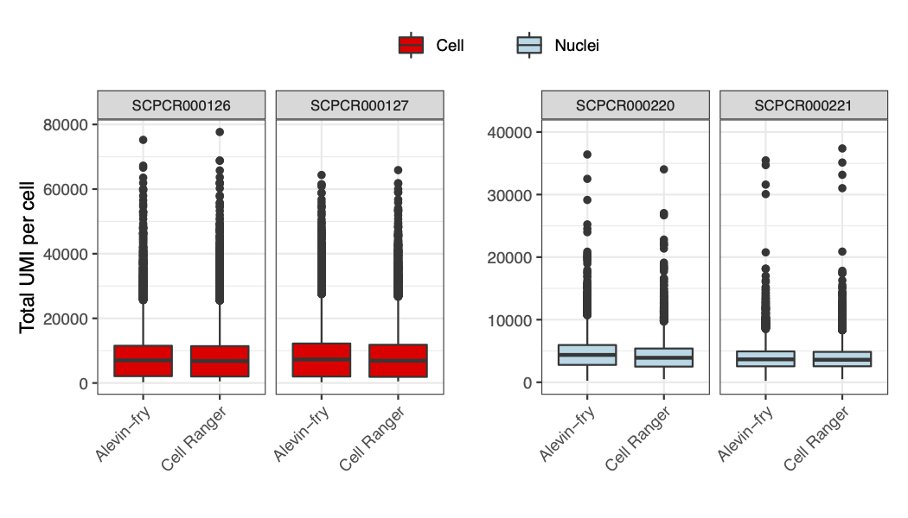
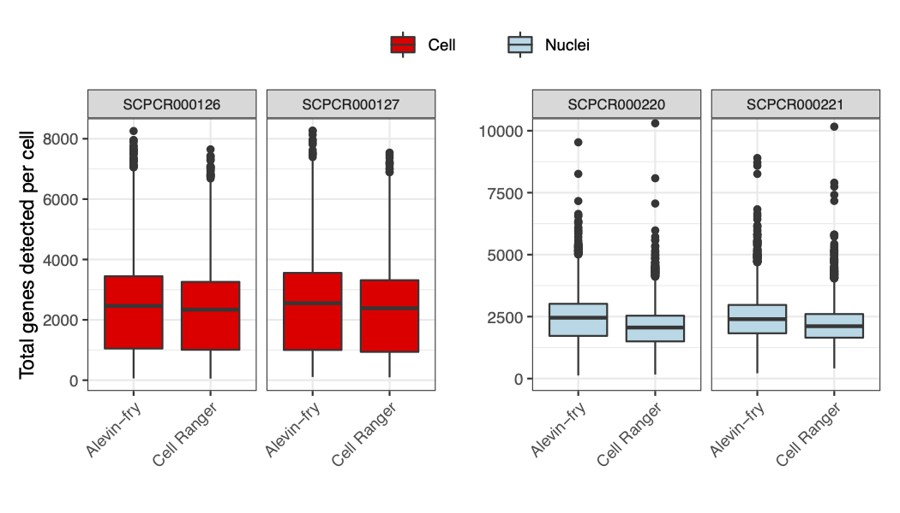

# Frequently Asked Questions 

#### Why did we use Alevin-fry for processing? 

We have found that Alevin-fry offers a faster, more memory efficient approach to processing single-cell and single-nuclei RNA-sequencing data than using 10X Genomics' [Cellranger count,](https://support.10xgenomics.com/single-cell-gene-expression/software/pipelines/latest/using/count) without sacrificing accuracy. 
Alevin-fry uses approximately 12-16 GB of memory per sample and completes alignment and quantification in less than an hour, while `Cellranger count` uses up to 25-30 GB of memory per sample taking anywhere from 2-8 hours to align and quantify one sample.
Additionally, comparison of the quantification output from samples processed with both Alevin-fry and Cell Ranger revealed similar distributions of UMI/cell and genes detected/cell among both tools.

We also compared the mean gene expression reported for each gene by both methods and observed a high correlation with a pearson R correlation coefficient of 0.98.  

*Insert Correlation graph comparing mean gene expression?*

*Need another statement about accuracy, pull from biorxiv?* 

